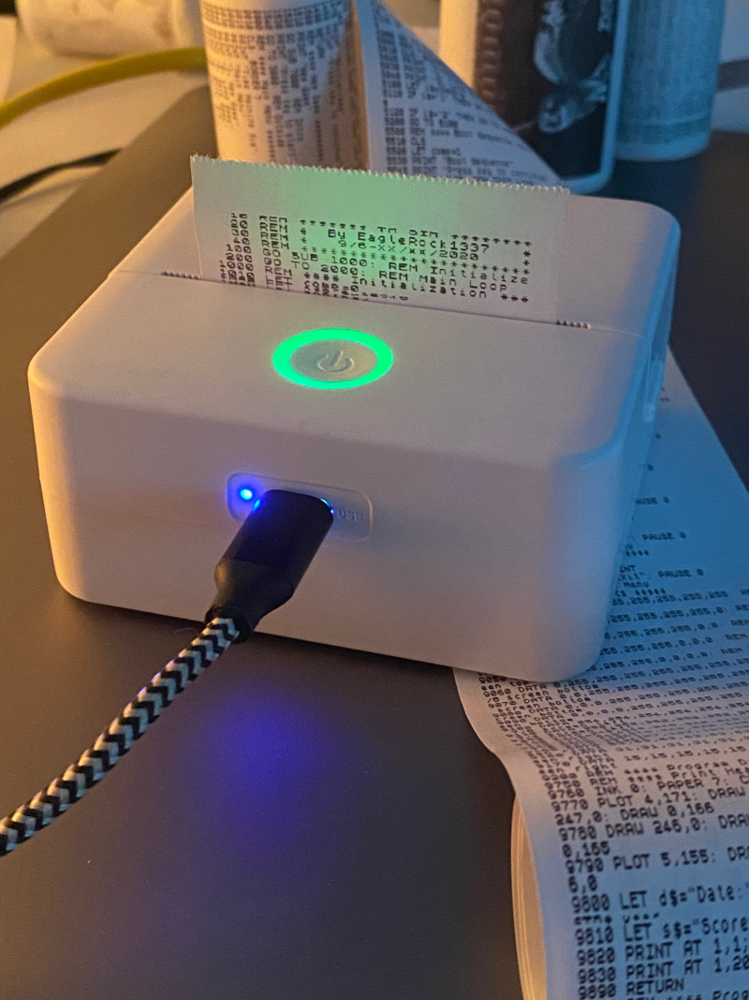

# X6 TinyPrint



Print text and images on the **X6h "cat printer"** thermal printer (the *Tiny Print*
mobile app) over **Bluetooth Low Energy**, from macOS.

Made by **Home Computer Group** — part of the HCG21 labs.

*English | [Italiano](#italiano)*

---

# English

## Why it's not "simple"

The X6h **does not speak ESC/POS**: it is a **raster** printer using a
proprietary "Qx" protocol (`51 78 cmd dir len payload crc8 FF`). It receives a
1-bit bitmap one scanline at a time. On top of that:

- The **motor pace is unstable** (small buffer, no flow control): data must be
  sent at the **right rate**, otherwise scanlines get dropped or compressed.
  Hence the `--speed` (motor speed) and `--row-delay` (pause between rows)
  options.
- The vertical scale is 1:1 (`--vscale 1.0`); if a print comes out
  squashed/stretched, tune `--vscale`.

The Bluetooth serial port `/dev/cu.X6h-xxxx` is **not** used for printing
(BLE only).

## Requirements

- macOS
- Python 3
- a X6h printer, powered on and in range

## Install

```bash
python3 -m venv .venv
./.venv/bin/pip install -r requirements.txt
```

## Usage

```bash
# text
./catprint.sh "Hello world!"
./catprint.sh "Receipt no.1\nTotal: 12.50 EUR\nThanks!" --align center --font bold

# from stdin
echo "line 1
line 2" | ./catprint.sh

# image (jpg/png), dithered by default
./catprint.sh --image photo.jpg

# ZX Spectrum screen (256x192, 1:1 pixels, inverted)
./catprint.sh --image screen.png --zx-screen
# same but with screen polarity (background as ink)
./catprint.sh --image screen.png --zx-screen --no-invert

# BASIC listing with the ZX Spectrum ROM font (32 columns)
./catprint.sh -f program.bas --font zx --zx-cols 32
# "true Spectrum" variant (white on black)
./catprint.sh -f program.bas --font zx --zx-cols 32 --invert

# self-test page (black bands + gradient + text)
./catprint.sh --test

# preview without printing (writes a PBM)
./catprint.sh "test" --dry-run /tmp/preview.pbm

# list BLE devices
./catprint.sh --list
```

### Options

| Option | Default | Description |
|---|---|---|
| `--font` | regular | `regular`, `bold`, `mono`, `mono-bold`, `menlo`, `verdana`, `georgia`, `zx` |
| `--font-size` | 32 | points (unused by `zx`) |
| `--zx-cols` | 32 | characters per line with the ZX font (ZX screen = 32, max 48) |
| `--invert` / `--no-invert` | auto | invert colors. In `--zx-screen` it is **on** by default; `--no-invert` turns it off |
| `--align` | left | `left`, `center`, `right` |
| `--strength` | 7 | darkness 1-7 (7 = darkest) |
| `--energy` | – | thermal energy 0.0-1.0 (overrides `--strength`) |
| `--speed` | 1 | motor speed (lower = faster) |
| `--row-delay` | 0.035 | pause between rows, seconds (data pacing) |
| `--vscale` | 1.0 | vertical scale compensation (1:1) |
| `--pad-bottom` | 24 | trailing blank rows (prevents text being cut off) |
| `--feed` | 80 | final paper advance in blank rows (~8 rows = 1 mm) |
| `--width` | 384 | printhead width in pixels |
| `--device` | X6h-0000 | Bluetooth name |
| `--address` | – | device UUID (skips scanning) |
| `--retries` | 4 | connection attempts |
| `--delay` | 0.0 | seconds to wait before disconnecting the printer |
| `--no-dither` | – | disable dithering (on by default for images) |
| `--zx-screen` | off | treat the image as a ZX 256x192 screen (inverted, 1:1) |
| `--verbose` | off | show printer notifications |
| `--dry-run FILE.pbm` | – | only generate a preview |
| `--test` | – | self-test page |

## Fine tuning

- Text **cut off at the bottom** → increase `--pad-bottom`.
- Image **squashed/stretched** vertically → adjust `--vscale`.
- Image **compressed with missing rows** → data is too fast: increase
  `--row-delay` (or increase `--speed`).
- Image **stretched with white gaps** → data is too slow: decrease
  `--row-delay` (or decrease `--speed`).
- Print **too light** → increase `--strength`; **too dark** → decrease it.

## Notes

- The printer is found by Bluetooth name (`X6h-0000` by default).
- On first run macOS may ask for **Bluetooth** permission for the terminal.
- It's a raster printer: text is drawn as an image, so accents and Unicode work
  through the system fonts.
- `--zx-screen` maps a ZX screen 1:1; with the 384-dot head, 32 columns are
  1.5x, 24 columns are exactly 2x, 48 columns are 1:1.

## Acknowledgements

- Protocol format documented by **parzivail**, *"Documenting the X6h Mini BLE
  Thermal Printer"*.
- Inspired by the community projects **Cat-Printer** (NaitLee) and
  **TinyPOS-Bridge** (sajjad-amin).
- ZX Spectrum ROM font (`zx82.ch8`) from **ivop/8x8-fonts**.
- Thanks to the **bleak** and **Pillow** maintainers.
- Sample ZX screens and listings belong to their respective authors and are
  included for testing only.

## License

Released under the **GNU General Public License v3.0 or later**
(SPDX: `GPL-3.0-or-later`). See [LICENSE](LICENSE).

---

# Italiano

Stampa testo e immagini sulla stampante termica **X6h** (le piccole "cat
printer" dell'app *Tiny Print*) via **Bluetooth Low Energy**, dal Mac.

Realizzato da **Home Computer Group** — parte dei laboratori HCG21.

## Perché non è "semplice"

La X6h **non parla ESC/POS**: è una stampante **raster** con protocollo
proprietario "Qx" (`51 78 cmd dir len payload crc8 FF`). Riceve una bitmap
monocromatica riga per riga. Inoltre:

- La **velocità del motore è instabile** (buffer piccolo, niente controllo di
  flusso): i dati vanno inviati al **ritmo giusto**, altrimenti righe vengono
  scartate o compresse. Da qui i parametri `--speed` e `--row-delay`.
- La scala verticale è 1:1 (`--vscale 1.0`); se una stampa esce
  schiacciata/allungata si regola `--vscale`.

La porta seriale Bluetooth `/dev/cu.X6h-xxxx` **non** serve per stampare (solo
BLE).

## Requisiti

- macOS
- Python 3
- una stampante X6h, accesa e nel raggio

## Installazione

```bash
python3 -m venv .venv
./.venv/bin/pip install -r requirements.txt
```

## Uso

```bash
# testo
./catprint.sh "Ciao mondo!"
./catprint.sh "Scontrino n.1\nTotale: 12,50 EUR\nGrazie!" --align center --font bold

# da stdin
echo "riga 1
riga 2" | ./catprint.sh

# immagine (jpg/png), con dithering (default)
./catprint.sh --image foto.jpg

# schermata ZX Spectrum (256x192, pixel 1:1, invertita)
./catprint.sh --image schermata.png --zx-screen
# come sopra ma con la polarita' dello schermo (fondo in inchiostro)
./catprint.sh --image schermata.png --zx-screen --no-invert

# listato in BASIC con il font ROM dello ZX Spectrum (32 colonne)
./catprint.sh -f programma.bas --font zx --zx-cols 32
# variante "vera" dello Spectrum (bianco su nero)
./catprint.sh -f programma.bas --font zx --zx-cols 32 --invert

# pagina di collaudo (bande nere + gradiente + testo)
./catprint.sh --test

# anteprima senza stampare (genera un PBM)
./catprint.sh "test" --dry-run /tmp/anteprima.pbm

# elenco dispositivi BLE
./catprint.sh --list
```

### Opzioni

| Opzione | Default | Descrizione |
|---|---|---|
| `--font` | regular | `regular`, `bold`, `mono`, `mono-bold`, `menlo`, `verdana`, `georgia`, `zx` |
| `--font-size` | 32 | punti (non usato da `zx`) |
| `--zx-cols` | 32 | caratteri per riga col font ZX (schermata ZX = 32, max 48) |
| `--invert` / `--no-invert` | auto | inverti i colori. In `--zx-screen` è **attivo** di default; `--no-invert` lo disattiva |
| `--align` | left | `left`, `center`, `right` |
| `--strength` | 7 | intensità 1-7 (7 = più scuro) |
| `--energy` | – | energia termica 0.0-1.0 (sovrascrive `--strength`) |
| `--speed` | 1 | velocità motore (più basso = più veloce) |
| `--row-delay` | 0.035 | pausa tra le righe in secondi (ritmo dei dati) |
| `--vscale` | 1.0 | compensazione scala verticale (1:1) |
| `--pad-bottom` | 24 | righe bianche in fondo (evita il taglio del testo) |
| `--feed` | 80 | avanzamento carta finale in righe bianche (~8 righe = 1 mm) |
| `--width` | 384 | larghezza testina in pixel |
| `--device` | X6h-0000 | nome Bluetooth |
| `--address` | – | UUID del dispositivo (salta la scansione) |
| `--retries` | 4 | tentativi di connessione |
| `--delay` | 0.0 | secondi di attesa prima di scollegare la stampante |
| `--no-dither` | – | disattiva il dithering (attivo di default per le immagini) |
| `--zx-screen` | off | tratta l'immagine come schermata ZX 256x192 (invertita, 1:1) |
| `--verbose` | off | mostra le notifiche della stampante |
| `--dry-run FILE.pbm` | – | genera solo l'anteprima |
| `--test` | – | pagina di collaudo |

## Regolazione fine

- Testo **tagliato in fondo** → aumenta `--pad-bottom`.
- Immagine **schiacciata/allungata** in altezza → regola `--vscale`.
- Immagine **compressa e righe mancanti** → i dati vanno troppo veloci:
  aumenta `--row-delay` (o aumenta `--speed`).
- Immagine **allungata con spazi bianchi** → i dati vanno troppo lenti:
  diminuisci `--row-delay` (o diminuisci `--speed`).
- Stampa **chiara** → aumenta `--strength`; **troppo scura** → diminuiscila.

## Note

- La stampante si trova per nome Bluetooth (`X6h-0000` di default).
- Alla prima esecuzione macOS può chiedere il permesso **Bluetooth** al terminale.
- È una stampante raster: il testo è disegnato come immagine, quindi accenti e
  Unicode funzionano tramite i font di sistema.
- `--zx-screen` mappa la schermata ZX 1:1; con la testina da 384 dot, 32 colonne
  sono 1.5x, 24 colonne sono esattamente 2x, 48 colonne sono 1:1.

## Riconoscimenti

- Formato del protocollo documentato da **parzivail**, *"Documenting the X6h Mini
  BLE Thermal Printer"*.
- Ispirato ai progetti della community **Cat-Printer** (NaitLee) e
  **TinyPOS-Bridge** (sajjad-amin).
- Font ROM dello ZX Spectrum (`zx82.ch8`) da **ivop/8x8-fonts**.
- Grazie ai manutentori di **bleak** e **Pillow**.
- Le schermate e i listati ZX di esempio appartengono ai rispettivi autori e
  sono inclusi solo a scopo di test.

## Licenza

Rilasciato sotto **GNU General Public License v3.0 o successiva**
(SPDX: `GPL-3.0-or-later`). Vedi [LICENSE](LICENSE).
